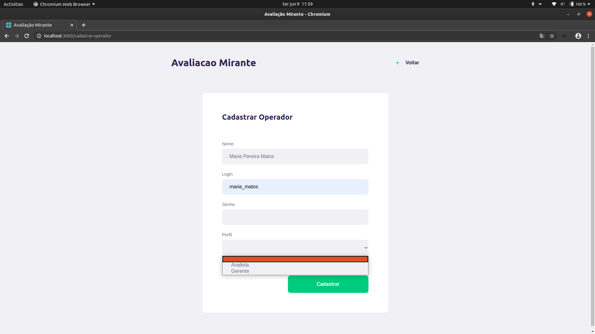
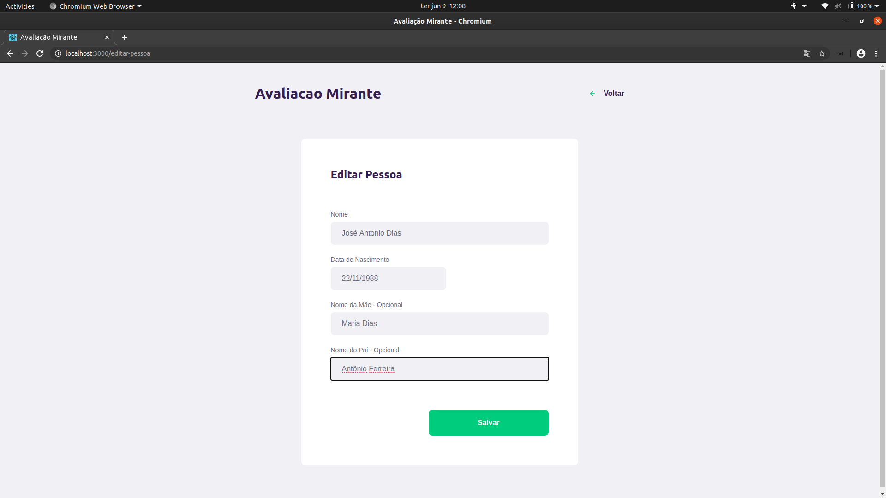

    <h1>Avaliação Mirante</h1>
    

        Organize de maneira fácil contato de pessoas e cadastros dos operadores de sua empresa!
    

    

        <a href="#tecnologias">Tecnologias</a>
        &nbsp;&nbsp;&nbsp;|&nbsp;&nbsp;&nbsp;
        <a href="#desenvolvimento">Desenvolvimento</a>
        &nbsp;&nbsp;&nbsp;|&nbsp;&nbsp;&nbsp;
        <a href="#integracao">Integração</a>
        &nbsp;&nbsp;&nbsp;|&nbsp;&nbsp;&nbsp;
        <a href="#telas">Telas</a>
        &nbsp;&nbsp;&nbsp;|&nbsp;&nbsp;&nbsp;
        <a href="#creditos">Créditos</a>
    

<h2 id="tecnologias">Tecnologias</h2>

+ [React](https://github.com/facebook/create-react-app)
+ [Axios](https://github.com/axios/axios)
+ [Cpf-cnpj-validator](https://github.com/carvalhoviniciusluiz/cpf-cnpj-validator)
+ [React-datepicker](https://github.com/Hacker0x01/react-datepicker)
+ [Sweetalert](https://sweetalert.js.org/)

<h2 id="instalacao">Instalação</h2>

``
$ npm install 
``

<h2 id="desenvolvimento">Desenvolvimento</h2>

``
$ npm start
``

A aplicação estará disponível no endereço: [http://localhost:3000](http://localhost:3000).

Certifique-se de que a API [Avaliação Mirante - Backend](https://github.com/amandabezerra/avaliacao-mirante-backend) está disponível no endereço [http://localhost:8080](http://localhost:8080).

<h2 id="integracao">Integração</h2>

API para utilização da aplicação está disponível no repositório [Avaliação Mirante - Backend](https://github.com/amandabezerra/avaliacao-mirante-backend).

<h2 id="telas">Telas</h2>

### Login

### Administrador

### Gerente

### Analista

